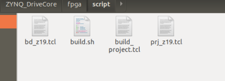

# ZYNQ_DriveCore

## 概述

Xilinx ZYNQ平台 Linux底层驱动包，实现PS与PL 内存交互。

* 测试平台 ALINX Z19， FPGA XCZU19EG-2FFVC1760I，实际上代码适用于任意xilinx zynq 平台。
* VIVADO 2019.1， SDK2019.1
* 寄存器交互参考 https://xilinx-wiki.atlassian.net/wiki/spaces/A/pages/18842412/Accessing+BRAM+In+Linux#AccessingBRAMInLinux-1.1.1.2AccessingRegisters 
* DMA参考 https://github.com/ikwzm/udmabuf

## 路径

* fpga目录存放fpga工程相关文件，工程通过脚本方式管理。在script目录下，运行build.sh即可重建demo工程，注意使用前修改build.sh中的VIVADO安装目录。

  

